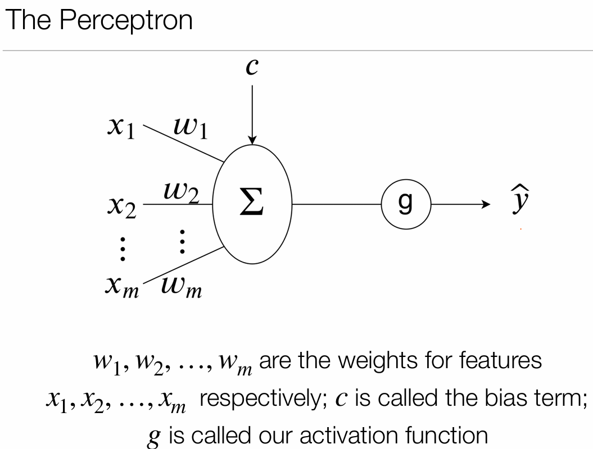
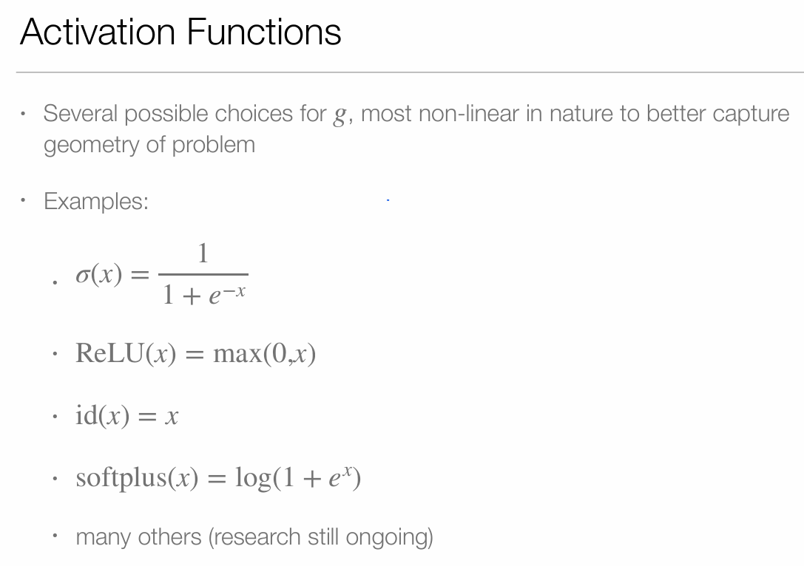
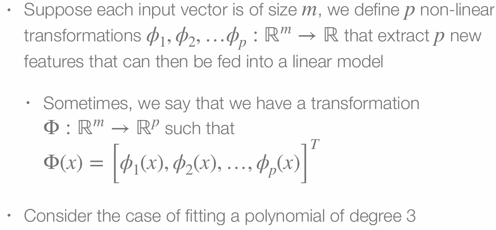
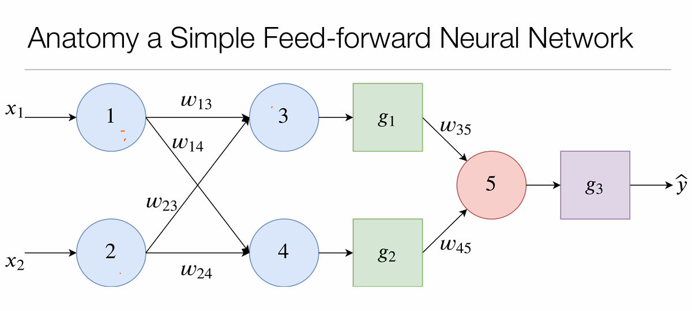
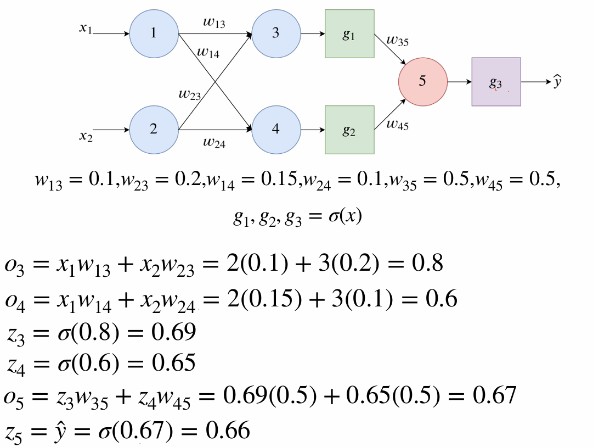
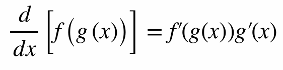
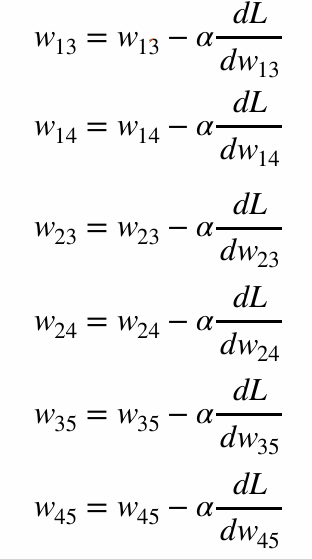

# Feed Forward Neural Networks

# Brain
• Brain considered most adaptable form of intelligence 
known 
• Don’t understand a lot about the brain 
• Probably understand the motions of celestial bodies 
better than we understand the brain 
• Nevertheless, we can draw upon our crude 
understanding of the brain to achieve intelligence

## Looking at the perceptron

• If we try to write out the perceptron mathematically we 
get 

̂
y(x) = g(wTx +c)
This should look sort of familiar

## Activation Function

## Perceptron
• The perceptron is a clearly a linear model! 
• Sigmoid and Linear Regression can be considered 
special cases! 
• Is this sufficient?

### Linear Models
• Linear Models cannot 
adequately model all 
phenomena 
• E.g. the adjacent classification 
problem
• How do we handle such 
cases?

## Non-Linear Models
• One Method is to use a non-linear basis transformation

• This is a non-linear model

• We can simply define 3 transformations  ϕk(x) = xk where  is the index of the 
transformation (i.e. taking on values of 1, 2, and 3)

• Using our transformations, we 
can then train a linear 
regression model that allows 
us to solve the problem well 
enough
• Similar processes can be used 
for other cases

### Learning Transormations
• Engineering these feature transformations is difficult and 
time consuming 
• Can we automate this process?

## From Perceptrons to Brains
• A brain is made up of more than one perceptron 
• Furthermore, it has layers of these perceptrons that feed data into each 
other 
• What if we chain layers of perceptrons together 
• Tune them together as part of learning process 
• Earlier layers (called hidden layers) encode (non-linear) transformations  
• Hidden layers always use a non-linear activation function! 
• Last layer (called the output layer) essentially performs logistic regression 
or linear regression on the data transformed by the hidden layers

## Feed-Foward Neural Networks
• NNs are represented as a sequence of matrix operations 
• Just like with Linear Regression and Logistic Regression, 
NNs weights are randomly initialised  
• Passing data through the neural network is called making 
the forward pass  
• Loss is calculated using same procedure like linear 
models 
• Get predictions and compare predictions with actual 

### Forward Pass Example
• Suppose that we randomly initialised the weights of our network 
• We want to train it to solve a regression problem 
• We use MSE Loss

Forward Pass with single data point:

### Forward Pass
• We predicted 0.67 and expected 1.0 
• MSE Loss is  
(1.0 − 0.67)2 = 0.11
• So we made a prediction and we were able to assess 
how badly we were off 
• How to adjust weights?

### Backward Pass - Problems
• Recall that to use gradient descent, we need to use the 
gradient wrt to the loss 
• For most parameters in the network, we don’t have 
access to that gradient directly! 
• How can we compute it?

### Chain Rule
• When the output of one function becomes the input of 
another, this is an example of function composition 
• When two functions are composed, we can can calculate 
the gradient wrt to the initial input using the chain rule

## Backpropogation
• Main method of training neural 
networks
• Exploits the chain rule 
repeatedly
• gradients flow back and 
accumulate 
• A form of dynamic 
programming

1. Compute gradients wrt to inputs 
2. Use chain rule to get gradients of parameters wrt to 
loss, going back through edges as needed to add 
gradients together 
3. Use these gradients in gradient descent

## Update Step
• Now that we have the gradients, we can now apply the 
standard update step from gradient descent 
• For our example, let  
α =1.0
• In most cases, this is very high, we are only using it to 
illustrate the training process

## Theoretical Properties
• Universal Approximation Theorem: a neural network with a 
single hidden layer can approximate any continuous 
function on a hidden compact subset of . 
ℝ
• Basically, nearly any function can, in principle, be learnt by 
a neural network 
• In practice, doesn’t work out 
• No guarantee that we know the architecture 
• No guarantee we could ever find the weights needed

# Practical Problems
• Neural Networks rely on large 
matrices
• Uses a lot of Linear Algebra
• Might be expensive 
computationally 
• GPUs and related co
processors can help

# Practical Problems
• Neural Networks are also prime 
examples of high variance 
models
• Keeping architectures small is 
vital
• But deciding architectures is 
still difficult 
• AutoML helps to some 
degree with very well
defined tasks

Practical Problems
• These types of networks are good for tabular data 
• Many interesting types of data are not tabular 
• E.g. images 
• How can we solve this?
