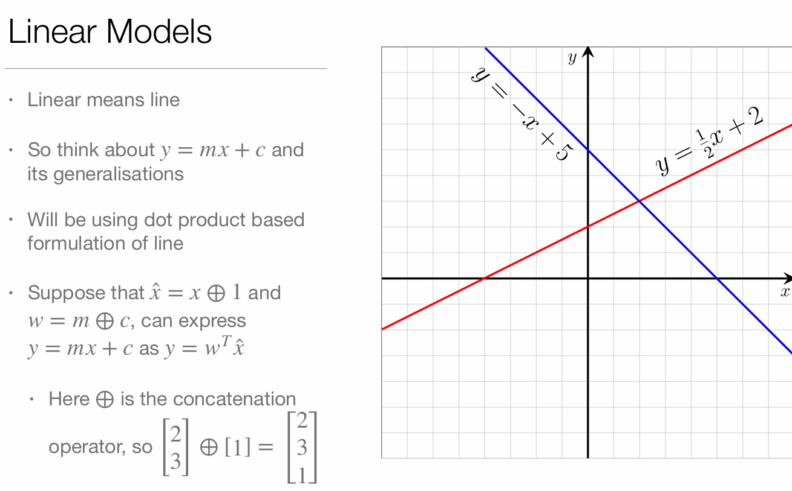
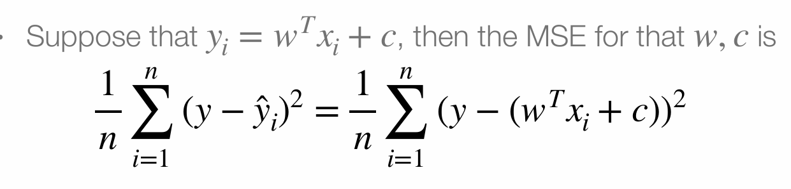
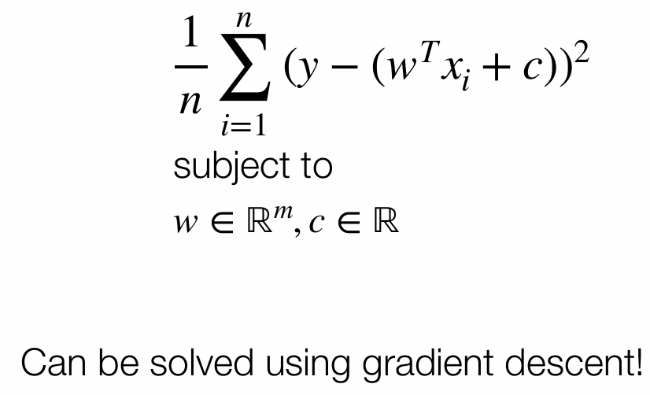
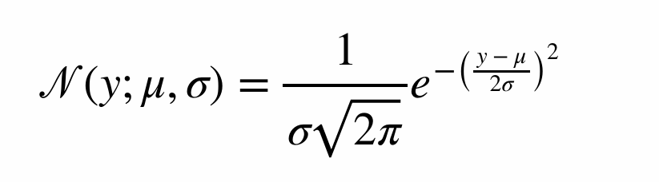
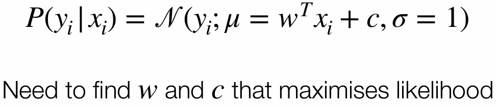
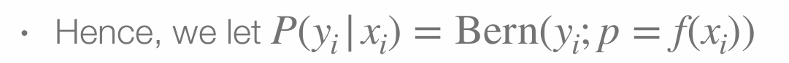
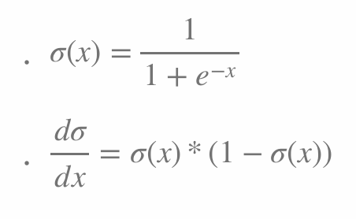
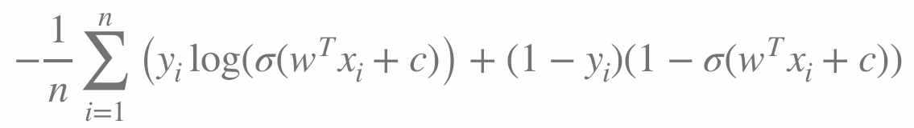
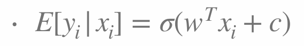
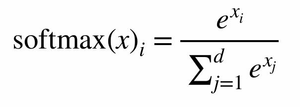

# Machine Learning
• in machine learning experiments we discussed the construction of machine learning pipelines  
• And ML concepts that apply across many models 
• This week, we will look at an actual family of machine learning models - linear 
models - that are used for supervised learning. 
• Output is dependent on linear function of input 
• Concepts explored are important for neural networks 
• Linear models have a formal basic in probability  
• Not all machine learning models have such a formal basis 
• Will look at both geometric and probabilistic interpretations

# Linear Models
• Linear means line

• So think about y =wTx+cand its generalisations where 

•x ∈ℝn
•w ∈ℝn
•y ∈ℝ
•c ∈ℝ
• Will be using dot product based formulation of line

# Linear Regression
• Used for regression problems 
• Recall that in regression, we have independent/input variables 
drawn from X =ℝm and dependent variable Y =ℝ

•m - number of input features
•n - number of data points used for training
 
• Want to learn function from X to Y such that function captures 
general relationship well 
• This function is our model

## Linear Regression - geometric interpetation
• Will look at geometric interpretation first 
• We assume that the relationship between input variables 
and output variable is linear or captured by linear function 
• In other words,  y = wTx + c

• Will look at geometric interpretation first 
• We assume that the relationship between input variables 
and output variable is linear or captured by linear function 
• In other words,  yi = wTxi + c
w = weights that apply to every example
c = intercept for every example

# Linear Regression
• Essentially, linear regression is about finding he best-fit 
line for our data 
• How can we formalise a notion of finding the best-fit line?
Optimisation!

# Measuring Line Quality
• Can’t simply add up errors 
• Errors will cancel each other out 
• Also, we want to be “fair” to all data points 
• Need way to measure line quality that circumvents these 
problems

# Mean Squared Error - MSE
• Mean Squared Error avoids these problems 
• By squaring the error, we ensure that we get positive 
contributions to sum - errors would not cancel each 
other out 
• By taking the mean, we are “fair” to other data points!

# Linear Regression As an Optimisation Problem
• Hence, the problem of finding a best fit line can be 
framed as an optimisation problem of the form

Can be solved using gradient descent!

# Linear Regression - Probabilistic Perspective
• Probabilistic perspective very important to understand 
neural networks 
• Is a bit trick and makes assumptions of linear regression 
much more apparent 
• MSE loss is not just meaningful from a geometric 
perspective - also meaningful from a probability 
perspective as well 
• Will arrive at the same conclusion, but through a different 
avenue

# Supervised Learning from a Probability Perspective

• From a probability perspective, our inputs (X ) are random 
variables, and our outputs (Y) are random variables 
• Our prediction for output should be what we expect Y to 
be if we know  X
• In other words, our function is always E[Y|X]
• To compute E[Y|X], we need to know P(Y|X)
• How to find P(Y|X)?

• To compute E[Y|xi], we need to know P(Y|X = xi) for all i
• How to find P(Y|X = xi) for all i?
Use MLE to fit P(Y|X)
• We need to make some simplifying assumptions such as 
the form of P(Y|X)
• Let’s assume that P(Y|X) follows a normal distribution 
• However, recall that distributions are characterised by a 
set of parameters 
• How can we find parameters for P(Y|X)?

• We let parameters of P(Y|X) be a function of X.  

• In Linear Regression, we assume μ is a linear function of 
our inputs, and that σ is 1. 
• Hence

# Linear Regression - getting predictions
• So we fit the distribution  
• Now what? 
• Recall that for a normal distribution, the expectation is simply  
• Hence, once we fit the distribution, our output is simply 
wTxi + c
• Can use intermediary outputs in optimisation 

# Logistic Regression
• Despite its name logistic regression is actually used for classification 
rather than for regression per se 
• We output the probability of a data point belonging to the different 
classes 
• Two main variants: 
• Binary  
• Multi-class (NOT multi-label) 
• Now that we have seen how MLE can be used to fit a machine learning 
model, we shall look at logistic regression primarily from a probabilistic 
perspective

# Binary Logistic Regression
• Can model outcomes as yes (1) or no (0) 
• These can be modelled as probability of true 
• When we have two possible outcomes, what probability 
distribution do we use?
• We use the Bernoulli Distribution 
Hence

# The problem of the success parameter
• The success parameter of a Bernoulli distribution is 
bounded within the range 0 to 1 
• Hence, we need to ensure that f(xi), which is the success parameter, is also bounded between 0 and 1
• How can we achieve this? 

 is a bounded 
• We use the logistic sigmoid function 
• Usually denoted as σ

# Logistic Sigmoid
• Logistic Sigmoid is special class 
of functions
• We use the standard logistic 
sigmoid
• And usually just say sigmoid 
function
• Squashes all input between 0 
and 1 inclusive

# Sigmoidal activation function usage
• We let 
P(yi|xi) = Bern(yi;p = σ(wTxi + c)) = pyi(1 − p)1−yi
• Note that this is still considered a linear model 
• As the input to the sigmoid function is a linear function of 
the problem input data 
• Just like before, we use MLE to derive a loss function 
that we would use to get good values of 
w and c

# Optimising NLL for Logistic Regression
• Just like before, we replace the summation with the 
mean for numerical stability  
• So, our final loss function is 

# Expectation of Logistic Regression

• We output probability score! 
• Can use this prediction directly in optimising model

# Logistic Regression - Linear Separators
• The linear function in the sigmoid represents a 
hyperplane (generalisation of a line) that tries to separates 
the two classes 
• Dot product tells us which side of the line a point is 
located 
• Problems where the data is difficult to separate linearly 
cannot be adequately solved by linear regression :(  
• That is where neural networks come in

# Multiclass-Logistic Regression
• Multi-class LR differs from Binary LR in several important 
ways 
• Multi-class LR uses a categorical distribution  
• Instead of learning a weight vector, we learn a weight matrix 
• If we have m features and d classes, our weights is a m×d matrix. In addition, instead of learning a single intercept, we learn d intercepts stored as a vector of length d
Hence WTxi +c ∈ ℝd
• Each component represents the relative strength of the 
association towards each class 
• Need to convert this to probabilities 
• Conventional way is to use softmax function (which 
replaces sigmoid)

# Generalised Linear Models
• Linear regression and logistic regression are members of a 
family of models called GLMs 
• Other similar models exist: 
• Laplace Regression 
• Poisson Regression 
• Probit Regression 
• Important building block towards developing neural networks

# Regularisation 
• Recall the problem of overfitting 
• We can mitigate overfitting through the use of a regularisation term 
• Core idea: larger magnitude weights imply overfitting 

•ℓp regularisation term is λ||w||p, where λ is the regularisation coefficient that controls the degree of influence regularisation has on the loss function 

• Regularisation term added onto loss function to penalise the magnitude of 
weights 
• Formal probabilistic basis: regularisation encodes information on prior distribution 
of parameters 

•ℓ2 regularisation is probabilistically equivalent to Bayesian Linear Regressio

