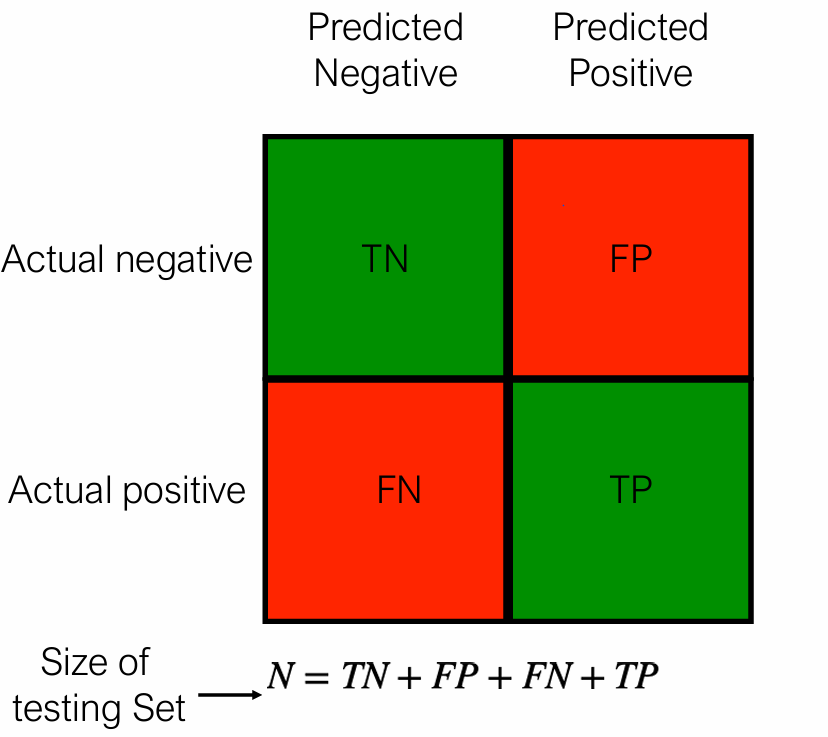
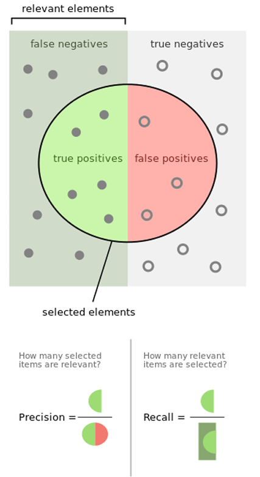
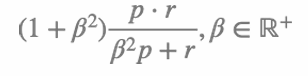
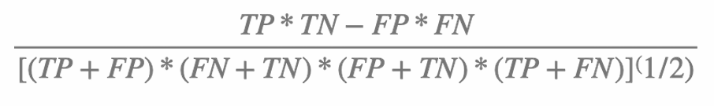
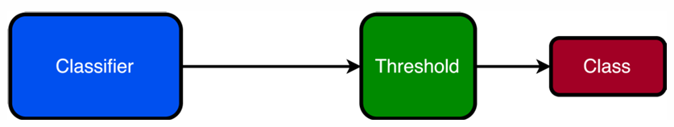

# Machine Learning Experiments

# Confusion and Contingency Matrices
• Will look at the binary case for classification to build intuitions about which 
metrics to use to evaluate a classification model
• Binary classification 
• Two possible outcomes: true and false
• Two possible outputs: true and false
• Encode results of classifier tests as 2 x 2 matrix of counts
• Use counts to compute metrics

# Contingency Matrices
• True Positives - actual outcome is true, model outputs - TP
true
• True Negatives - actual outcome is false, model outputs - TN
false
• False Positives - actual outcome is false, model outputs -FP
true
• False Negatives - actual outcome is true, model outputs - FN
false

# Accuracy
• Accuracy formula
• (TP + TN)/N
• Bounded between 0 and 1 (inclusive)
• Proportion of correct predictions
• Seems like a good metric
• Is it?
• What happens if we just predict all positive or all negative

## Problems with Accuracy
• Accuracy makes several assumptions
• Assumes that all misclassifications are equally bad
• Example: classify someone as having a diseases vs not having a disease. For some 
diseases, such as HIV, false negatives are much worse than false positives
• Assumes that problem is balanced - probability of positive class and negative class is 
equal or close to equal
• Bad assumption in a lot of cases
• Example: Link Prediction to suggest FB friends
• Example: Credit card fraud 
• Need better metrics

# Precisions and Recall
• Precision TP/(TP+FT)
• What proportion of predicted 
positives are actual positives
• Sensitivity, Recall
• What proportion of overall positives 
were predicted by the model
• Specificity TP/(TP+FN)

# Score
• Composite score that is the 
weighted harmonic mean of 
precision and recall
• measures the effectiveness of 
retrieval with respect to a user 
who attaches β times as much 
importance to recall as precision 
controls
• Most common setting
β = 1
• F1 given by

# MCC - Mathew Correlation Coefficient
• F1 is not a solution to all problems
• Note that both precision and recall have true positive 
counts in their numerator 
• De-prioritises negatives
• F1 is not that “interpretable”, we just know that a higher  is 
better

• If we predict either all positive or all negative, MCC is 0
• If we predict all correctly, MCC is 1
• If we predict all incorrectly, MCC is -1
• An eggceleent example:
https://lettier.github.io/posts/2016-08-05-matthews
correlation-coefficient.html

# AUROC - More commonly abbreviated AUC
• Many classifier models are probabilistic in nature
• Outputs probability of a class
• We then convert a probability to a label

## AUC
• Most of the time, we let 0.5 be our threshold
• If we let the threshold be a hyperparameter, then what 
defines a good classifier?
• If let probability act as score, positive cases should have 
higher score in expectation than negative cases
• We can compute this expectation using the ROC 
(Receiver Operator Characteristic)

As we adjust the threshold
• The true-positive rate, i.e. the precision changes
• As does the false positive rate, i.e. the (1 - recall) 
changes

• We adjust the threshold and compute the the precision and (1 - recall)
• Plot precision vs (1 - recall)
• Compute area of resultant curve
• This gives us the the probability that a classifier will rank a randomly chosen 
positive instance higher than a randomly chosen negative one
• Higher AUC, the better
• AUC of 1.0 is perfect classifier
• AUC of 0.5 is random 
• AUC of less than 0.5…. something is REALLY wrong

# Training Set-Testing Set
• Recall our discussion on training set and testing sets in Machine Learning Folder
• Such a paradigm has serious methodological problems
• We could have lucked out on the rows of data captured in 
the splits
• Or alternatively, had bad luck
• Neither is good

# k-fold Cross Validation
• Better alternative to Training-Set methodology to 
benchmark model performance
• Uses the entire dataset at various points in time
• Allows us to apply hypothesis testing techniques to 
results generated
• k Dataset split into  equal (mostly 
equal) blocks
• Instantiate  blank models. Each 
iteration
• Use single block as testing set
• Uses remaining blocks as training 
set
• Repeat until all blocks get a turn at 
being the testing set
• Record performance
• Compare models
• Use hypothesis testing

# k-stratified fold cross validation
• Suppose that we have n classes each with a different 
frequency in the dataset
• If we split the dataset into  blocks, we might not maintain 
those relative proportions
• Stratified fold cross validation remedies this by ensuring 
that each block has class proportions similar to the entire 
dataset
•
https://machinelearningmastery.com/cross-validation-for
imbalanced-classification/

# Analysing Performance Data
• So, you have a collection of scores on the performance of different models
• How to go about analysing them
• Informally
• Find mean performance of each model
• Find Std. Deviation of performance for each model
• Model with highest mean performance coupled with lowest std. deviation 
is best considered best model
• Many papers adopt this line of thinking

## Analysing Performance Data - Hypothesis Testing
• While the previous methodology might fly in some circles, 
it isn’t the most scientifically robust methodology 
• To compare the performance of machine learning models, 
we can use standard hypothesis testing techniques and 
approaches
• Word of caution: the best methodologies are still very 
much open for debate
• No real consensus yet!
•
•
https://medium.com/dataseries/hypothesis-testing-in-machine-learning-what-for-and-why-ad6ddf3d7af2
https://www.geeksforgeeks.org/p-value-in-machine-learning/

# Unbalanced Data
• We saw that accuracy is particularly bad for measuring 
the performance of models on unbalanced datasets
• But what about training implications?
• Can feeding unbalanced data harm the training process 
itself?
• Yes, it can!

# Oversampling and Undersampling
• Oversampling - generates or duplicates data for 
underrepresented classes in data
• Undersampling - removes data for overrepresented 
classes in data 
• Many different methods of doing these, can’t just do it at 
random
• Approaches to oversampling include: SMOTE and 
ADASYN